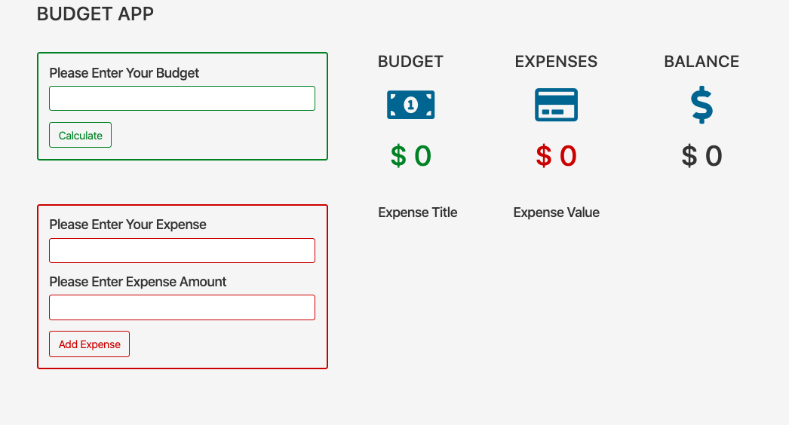

# budget-app

## Screenshot:

## Introduction:

This project was created by __john-smilga__
following [YouTube Video](https://www.youtube.com/watch?v=m_HJ3juuFvo)  It consists budget counting app that will do the calculation of budget, expenses and balance with ability to edit or delete expenses.

## Motivation:

 As student, I have been practicing working with `classes`, `this` and `setTimeout`.

## Objetive:

Structure the project in steps, push the code one stepp at the time of all to make a functional webpage.

## Technologies:
- HTML
- CSS, Bootstrap v4.1.1 and Awesome 5.3.1
- Javascript

## Status:
- Completed